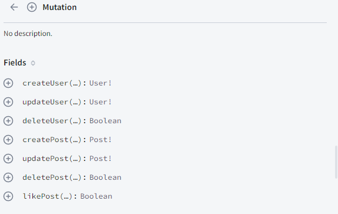
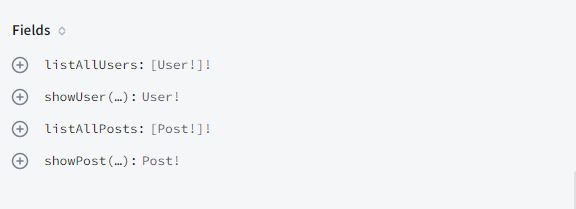
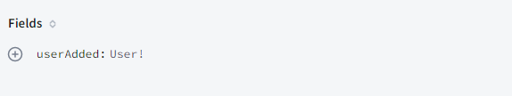
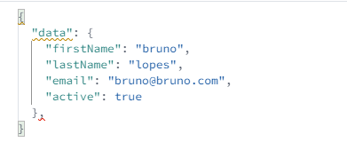
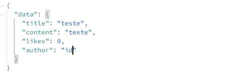
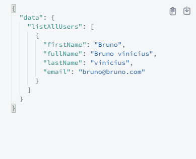

# graphql-project

## Tecnologias

- [Node](https://nodejs.org/en/)
- [MongoDB](https://www.mongodb.com/pt-br)
- [Javascprit](https://developer.mozilla.org/pt-BR/docs/Web/JavaScript)
- [Graphql](https://graphql.org)

## Projeto

Esse projeto é o backend de uma aplicação com crud completo para aprender e aplicar conhecimentos estudados sobre a incrivel tecnologia graphql, é possivel apenas criar um usuário e posts, assim como listá-los, atualizá-los e deletá-los.

## Instruções

- Para instalar todas as dependências utilizadas do projeto basta rodar o comando `yarn`
- O servidor pode ser iniciado com `yarn dev`, onde se tem acesso pelo `http://localhost:4000`
- É possivel abrir o studio explorer para fazer as requisições.

## Rotas da aplicação

- ### Mutations

- ### Querys

- ### Subscriptions

- ### Datas
  Os dados que devem ser enviados em atualizações ou criações de usuário.
   
  

Os dados que devem ser enviados em atualizações ou criações de posts.
 

Os dados retornados em uma listagemn de usuários.
 

